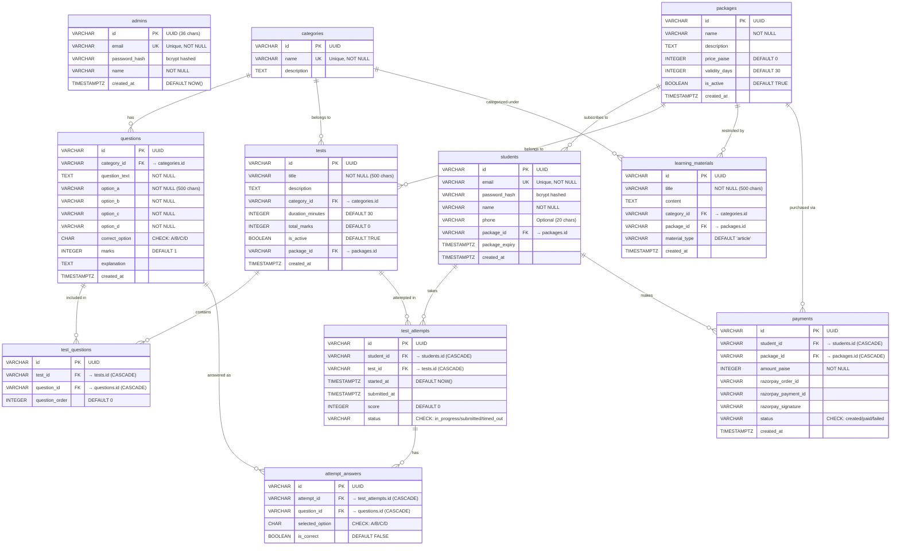

# Database Schema Documentation

> MockTest Pro ke database mein **10 tables** hain jo PostgreSQL mein asyncpg ke through managed hoti hain. Schema automatically initialize hota hai jab backend first time start hota hai (`database.py` → `init_schema()`).

---

## Entity Relationship Diagram

---

## Table Details

### 1. `admins`
Platform administrators. Default admin automatically seeded on first startup.
- **Default**: `admin@mocktest.com` / `admin123`
- Passwords bcrypt ke saath 12 rounds pe hashed hote hain

### 2. `packages`
Subscription plans jo students buy karte hain (e.g., Free, Pro, Unlimited).
- `price_paise`: Amount in paise (₹499 = 49900 paise)
- `validity_days`: Package ki validity (e.g., 30 days)

### 3. `categories`
Question/test categories (e.g., "Mathematics", "Physics", "GK").
- Unique name constraint

### 4. `students`
Registered students.
- `package_id`: Currently subscribed package
- `package_expiry`: Jab package expire hoga

### 5. `questions`
MCQ questions with 4 options (A/B/C/D).
- `correct_option`: CHECK constraint ensures only A, B, C, ya D
- `explanation`: Answer explanation (optional, shown after submission)

### 6. `tests`
Mock tests jo admin create karta hai.
- `duration_minutes`: Time limit for the test
- `total_marks`: Pre-calculated total marks
- Can be tied to a specific package (premium tests)

### 7. `test_questions` (Junction Table)
Many-to-many relationship between tests and questions.
- `question_order`: Order in which questions appear
- **UNIQUE constraint**: `(test_id, question_id)` — ek question ek test mein sirf ek baar

### 8. `test_attempts`
Student ke test attempts track karta hai.
- `status`: `in_progress` → `submitted` / `timed_out`
- `score`: Final score after submission

### 9. `attempt_answers`
Individual answers for each question in an attempt.
- `is_correct`: Auto-calculated on submission
- **UNIQUE constraint**: `(attempt_id, question_id)` — ek answer per question per attempt

### 10. `payments`
Razorpay payment records.
- `amount_paise`: Amount paid (in paise)
- `status`: `created` → `paid` / `failed`
- Razorpay fields store payment verification data

---

## Performance Indexes

Database mein ye indexes create hote hain for fast queries:

| Index Name                    | Table             | Column(s)    |
|-------------------------------|-------------------|-------------|
| `idx_questions_category`      | questions         | category_id |
| `idx_tests_category`          | tests             | category_id |
| `idx_tests_package`           | tests             | package_id  |
| `idx_test_questions_test`     | test_questions    | test_id     |
| `idx_test_attempts_student`   | test_attempts     | student_id  |
| `idx_test_attempts_test`      | test_attempts     | test_id     |
| `idx_attempt_answers_attempt` | attempt_answers   | attempt_id  |
| `idx_payments_student`        | payments          | student_id  |
| `idx_students_package`        | students          | package_id  |

---

## Delete Behavior (CASCADE / SET NULL)

| Parent Table | Child Table        | On Delete    |
|-------------|---------------------|--------------|
| packages    | students.package_id | SET NULL     |
| packages    | tests.package_id    | SET NULL     |
| packages    | learning_materials  | SET NULL     |
| packages    | payments            | CASCADE      |
| categories  | questions           | SET NULL     |
| categories  | tests               | SET NULL     |
| categories  | learning_materials  | SET NULL     |
| tests       | test_questions      | CASCADE      |
| tests       | test_attempts       | CASCADE      |
| questions   | test_questions      | CASCADE      |
| questions   | attempt_answers     | CASCADE      |
| students    | test_attempts       | CASCADE      |
| students    | payments            | CASCADE      |
| test_attempts| attempt_answers    | CASCADE      |
